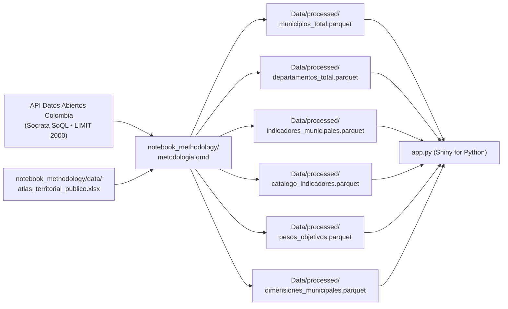

# Cuaderno Metodológico: Atlas Territorial LAFT (`notebook_methodology`)

Este directorio contiene el cuaderno metodológico interactivo y reproducible del **Atlas Territorial de Problemáticas en Colombia**, implementado en **Quarto (`.qmd`)** con motor de ejecución **Python (Jupyter)**.

El cuaderno documenta y ejecuta de extremo a extremo la formulación teórica, jurídica, matemática y estadística para la estimación del riesgo territorial de Lavado de Activos y Financiación del Terrorismo (LA/FT), y es la **fuente oficial directa de datos (Parquet) que consume la aplicación web Shiny (`app.py`)**.

---

## 📁 Estructura del Directorio de la Metodología

Todos los insumos del cuaderno (bases de datos de entrada, imágenes y activos) residen de forma autónoma dentro de este directorio:

```text
notebook_methodology/
├── data/                                 # Insumos tabulares del cuaderno
│   ├── atlas_territorial_publico.xlsx    # Libro consolidado oficial de fuentes territoriales
│   └── tabla_puntaje_global.xlsx         # Tablas primarias desagregadas por delito
├── images/                               # Recursos gráficos e imágenes del documento
│   └── clipboard-1721304052.png          # Infografías y esquemas metodológicos
├── metodologia.qmd                       # Cuaderno fuente Quarto con ejecución en Python
├── metodologia.html                      # Documento compilado HTML auto-contenido (embed-resources)
├── _quarto.yml                           # Configuración global del motor Quarto
└── README.md                             # Este manual y guía de estilo
```

---

## 🔄 Flujo de Datos: Cuaderno como Fuente Única de la App

El cuaderno Quarto no es un mero reporte estático: **consulta en vivo fuentes abiertas estatales mediante la API Socrata (`SoQL` con `LIMIT 2000` para cobertura municipal completa), ejecuta el pipeline analítico completo y exporta los datos en formato Parquet a la aplicación Shiny** utilizando rutas portables (`pyprojroot.here`):



---

## 🚀 Compilación y Ejecución

### 1. Requisitos previos
El cuaderno se ejecuta con el kernel registrado de Jupyter `atlas-territorial`:

```bash
# Sincronizar dependencias con uv
uv sync

# Registrar el kernel si se ejecuta por primera vez
.venv/bin/python -m ipykernel install --user --name atlas-territorial --display-name "Python (Atlas Territorial)"
```

### 2. Comandos Quarto

```bash
# Compilar el cuaderno a HTML auto-contenido y actualizar la copia pública en www/
quarto render notebook_methodology/metodologia.qmd
cp notebook_methodology/metodologia.html www/metodologia.html

# Previsualizar en vivo con recarga automática al editar
quarto preview notebook_methodology/metodologia.qmd
```

El archivo compilado `metodologia.html` se genera con `embed-resources: true` (HTML auto-contenido con tema Flatly y renderizado matemático KaTeX), ejecutable en cualquier navegador sin servidor web activo.

---

## 📐 Estándares de Estilo de Código y Documentación

Para garantizar una lectura fluida, trazabilidad técnica y mantenibilidad, todo el código y la narrativa del cuaderno deben cumplir estrictamente con las siguientes reglas:

### 1. Parámetros, Librerías y Notación Científica al Inicio
- **Setup Centralizado:** Todas las importaciones de librerías (`numpy`, `pandas`, `requests`, `pyprojroot.here`, `scipy.stats`, `sklearn.cluster.KMeans`, `plotnine`), rutas portables ancladas a `.here`, semillas aleatorias (`random_state=123`), cuantiles de winsorización (`cuantiles_winsor = (0.01, 0.99)`), hiperparámetros de K-Means y listas de dimensiones deben definirse exclusivamente en el primer chunk de inicialización.
- **Desactivación de Notación Científica:** Debe configurarse explícitamente el formateo numérico de Pandas y NumPy para evitar representaciones en exponente (`1.25e+02`), garantizando visualización legible de tasas y conteos:
  ```python
  pd.set_option("display.float_format", lambda x: f"{x:.4f}")
  pd.set_option("display.max_columns", 25)
  np.set_printoptions(suppress=True, precision=4)
  ```

### 2. Restricción Estricta de Longitud por Bloque (Máximo 50 Líneas)
- **Regla <= 50 LOC:** Ningún bloque de código (````{python}````) puede superar las **50 líneas de código**.
- Si una operación requiere más pasos, debe subdividirse en chunks lógicos consecutivos, cada uno con su correspondiente explicación conceptual previa.

### 3. Explicación Intuitiva Antes de Cada Bloque
- **Narrativa Previa Obligatoria:** Antes de abrir cualquier chunk de código, debe existir un párrafo explicativo en Markdown titulado `**Explicación intuitiva:**`.
- Este texto debe responder con claridad analítica:
  1. *¿Qué se está haciendo en este paso?*
  2. *¿Cuál es el propósito o justificación técnica de esta transformación?*

### 4. Comentarios Internos en el Código
- **Documentación de Parámetros y Pasos:** Dentro de cada chunk, cada sección de código debe contener comentarios que expliquen la lógica de las operaciones, la elección de parámetros y el propósito de cada variable.
- Se debe evitar código tácito o implícito sin comentarios descriptivos.

### 5. Convención de Nomenclatura y Enfoque Procedimental
- **`snake_case` Obligatorio:** Todas las variables, listas, diccionarios y DataFrames deben nombrarse en `snake_case` con nombres autodescriptivos en español (ej. `matriz_normalizada`, `indice_territorial_z`, `bloques_fuentes`).
- **Simplicidad Procedimental Directa:** Se priorizan transformaciones directas y legibles paso a paso con Pandas y NumPy en lugar de envoltorios o funciones abstractas anidadas que dificulten el seguimiento de los cálculos.

### 6. Pruebas de Calidad y Validación de Integridad
- Todo pipeline del cuaderno debe finalizar con un bloque de auditoría que evalúe y certifique:
  - Exactitud del total municipal ($N = 1.122$) y departamental ($N = 33$).
  - Suma estricta de los ponderadores CRITIC ($\sum w_j = 1.0 \pm 10^{-6}$).
  - Cobertura completa de las 13 dimensiones territoriales oficiales.
  - Ausencia total de valores nulos (`NaN`) o no finitos en los índices calculados.
